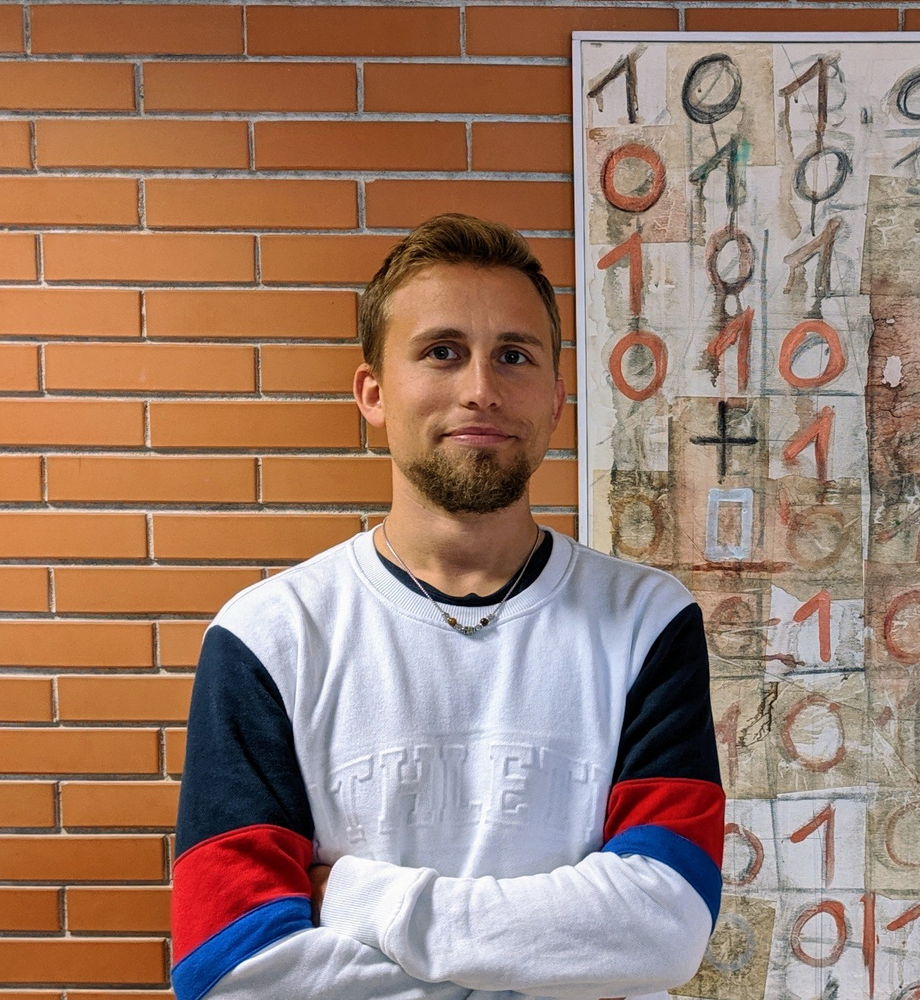

# About

Full CV [here](pdfs/CV.pdf).

Hi! I'm Assistant Professor of Computer Science (tenure track) at Ca' Foscari University of Venice. My research interests include algorithms and data structures for the manipulation and analysis of compressed strings and graphs, both from the theoretical and practical viewpoints and with applications to bioinformatics. I received my Ph.D. in Computer science from the university of Udine in 2017, with a [thesis](pdfs/Compressed Computation for Text Indexing.pdf) on dynamic compressed data structures under the supervision of Prof. Alberto Policriti. After that, I have been postdoc researcher for one year at the technical university of Denmark, Copenhagen (DTU), for two more years at the university of Pisa, and then Assistant Professor at LUISS Guido Carli University, Rome.

I co-authored more than 40 research articles within my research field and I developed the first C++ [library](github.com/xxsds/DYNAMIC) of dynamic compressed data structures, in addition to more than 30 other repositories dealing with data compression and bioinformatics. I am/have been on the program committees of IWOCA 2021, ISAAC 2021, CPM 2018, CPM 2020, SPIRE 2020, co-chaired the 13th Workshop on Compression, Text and Algorithms (WCTA 2018), and I have been invited speaker at ICTCS 2018, IABD 2019, CPM 2019, and SEA 2020. I am the recipient of the 2018 [Best Italian Young Researcher in Theoretical Computer Science](https://www.eatcs.org/index.php/italian-chapter) award of the Italian Chapter of the European Association for Theoretical Computer Science.

# Selected Publications

* Nicola Cotumaccio and Nicola Prezza. *On Indexing and Compressing Finite Automata*. To appear in **SODA 2021**.

* Nicola Prezza. *On Locating Paths in Compressed Tries*. To appear in **SODA 2021**.

* Anders Roy Christiansen, Mikko Berggren Ettienne, Tomasz Kociumaka, Gonzalo Navarro, Nicola Prezza. *Optimal-Time Dictionary-Compressed Indexes*. To appear in ACM Transactions on Algorithms (**TALG**).

* Nicola Prezza, 2020. *Optimal Substring-Equality Queries with Applications to Sparse Text Indexing*. To appear in ACM Transactions on Algorithms (**TALG**). Journal extension of:
	* Nicola Prezza, 2018. *In-Place Sparse Suffix Sorting*. Proceedings of the 29th Annual ACM-SIAM Symposium on Discrete Algorithms, **SODA 2018**. Pages 1496-1508.
  
* Travis Gagie, Gonzalo Navarro, and Nicola Prezza, 2020. *Fully-Functional Suffix Trees and Optimal Text Searching in BWT-runs Bounded Space*.  Journal of the ACM (**JACM**). [https://doi.org/10.1145/3375890](https://doi.org/10.1145/3375890). Journal extension of:
	* Travis Gagie, Gonzalo Navarro, and Nicola Prezza, 2018. *Optimal-Time Text Indexing in BWT-runs Bounded Space*. Proceedings of the 29th Annual ACM-SIAM Symposium on Discrete Algorithms, **SODA 2018**. Pages 1459-1477.
  
* Jarno Alanko, Giovanna D'Agostino, Alberto Policriti, and Nicola Prezza. *Regular Languages meet Prefix Sorting*. **SODA 2020**.

* Dominik Kempa and Nicola Prezza, 2018. *At the Roots of Dictionary Compression: String Attractors*. In Proceedings of the 50th Annual ACM SIGACT Symposium on Theory of Computing, **STOC 2018**, June 25-29, 2018, Los Angeles, CA. pp. 827-840. ACM.

# News

* Program committee of IWOCA 2021 (International Workshop on Combinatorial Algorithms) and ISAAC 2021 (International Symposium on Algorithms and Computation).
* I received the Italian National Scientific Habilitation (ASN) in Computer Science and in Computer Engineering.
* Program committee of the 27th International Symposium on String Processing and Information Retrieval [SPIRE 2020], to be held in Orlando, Florida.
* Invited speaker at the 18th Symposium on Experimental Algorithms June 16-18, 2020, Catania, Italy. [SEA 2020](http://www.sea2020.dmi.unict.it/).
* Invited speaker at The 5th International Workshop on Innovative Algorithms for Big Data [IABD 2019](https://sites.google.com/view/iabd2019/iabd2019), Kyoto.
* Program committee of the 31th Annual Symposium on Combinatorial Pattern Matching [CPM 2020], to be held in Copenhagen.
* Keynote speaker at the first [AlgPie](https://algpie.mimuw.edu.pl/) workshop organized by IGAFIT, Poland.
* Invited highlight speaker at the 30th Annual Symposium on Combinatorial Pattern Matching [CPM 2019](http://cpm2019.di.unipi.it/), Pisa.
* My PhD thesis has been awarded the UniUD [**PhD award**](https://qui.uniud.it/notizieEventi/ateneo/phd-awards-assegnati-alle-migliori-tesi-di-dottorato-2017) (for one of the six best PhD theses at the university of Udine in the year 2017).
* I have been awarded the [**"best italian young researcher in Theoretical Computer Science 2018"**](https://www.eatcs.org/index.php/italian-chapter) award by IC-EATCS! The award has been assigned during [ICTCS 2018](http://www.sti.uniurb.it/events/ictcs2018/cfp.html) in Urbino, where I also gave an invited talk.
* I taught a 3-weeks [summer school](http://www.udc.es/gl/iss/courses/courses_2018/Compact_data_structures) on compact data structures in collaboration with [Travis Gagie](https://www.cs.helsinki.fi/u/gagie/) from July 30 to August 17, 2018 at a Coruña (Spain). 
* Program committee of the 29th Annual Symposium on Combinatorial Pattern Matching [CPM 2018](http://cpm2018.sdu.edu.cn/).
* Co-chair of the 13th Workshop on Compression, Text and Algorithms [WCTA 2018](http://eventos.spc.org.pe/spire2018/).
