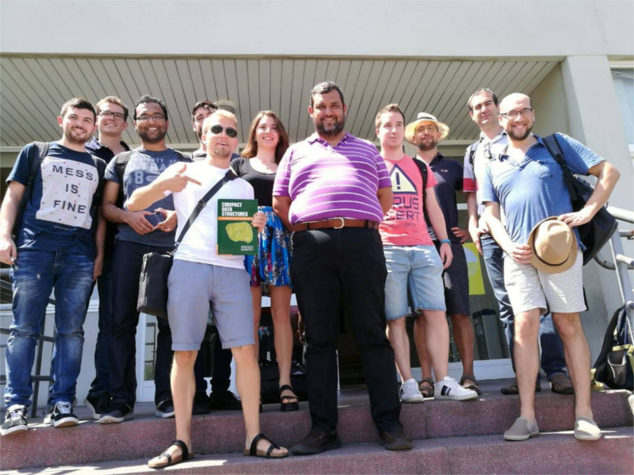

- [**Programmazione e laboratorio**](https://www.unive.it/data/insegnamento/336117). Ca' Foscari, Venezia, secondo semestre AA 2020/2021.

- [**Informatica per i beni culturali**](https://www.unive.it/data/insegnamento/345425/). Ca' Foscari, Venezia, primo semestre AA 2020/2021.

- [**Informatica**](https://www.luiss.it/cattedreonline/corso/254/D/1EEL2BASE/2019). LUISS Guido Carli, Roma, secondo semestre AA 2019/2020.

- [**Laboratorio di Fondamenti di Programmazione**](http://pages.di.unipi.it/bodei/CORSO_FP_19/FP/index.html). University of Pisa, primo semestre AA 2019/2020.

- [**Laboratorio di Fondamenti di Programmazione**](http://pages.di.unipi.it/bodei/CORSO_FP_18/FP/index.html). University of Pisa, primo semestre AA 2018/2019. 

- International summer school on [**Compact data structures**](https://www.udc.es/gl/iss/courses/courses_2018/Compact_data_structures/index.html). Universidade da Coruña (Spain). July 30 - August 17, 2018, 6 ECTS. Lecturers: Travis Gagie and Nicola Prezza. 

- [**Compact data structures**](http://www2.compute.dtu.dk/courses/02951/). PhD course. Technical University of Denmark (DTU), Kgs. Lyngby. September - December 2017. 

- Summer school: **Aligning DNA sequences on compressed collections of genomes**. The CODATA-RDA Research Data Science Applied workshops on Extreme sources of data, Bioinformatics and IoT/Big-Data Analytics, ICTP, Trieste. July 2017. 

- **Laboratorio di Architettura degli Elaboratori**. 3 ECTS. University of Udine. Fall 2015.

- **Laboratorio di Architettura degli Elaboratori**. 3 ECTS. University of Udine. Fall 2014.

- **Sequence Analysis for Epigenomics**. 2nd Bioinformatics Introductory Course, Polo d’Innovazione Genomica, Genetica e Biologia, Perugia. 

|  | 
|:--:| 
| *Me, Travis, Gonzalo (and his book!), and our wonderful class at the [**Compact data structures**](http://www.birdsproject.eu/course-compact-data-structures-during-udcs-international-summer-school-2018/) summer school in Coruña (2018)* |
